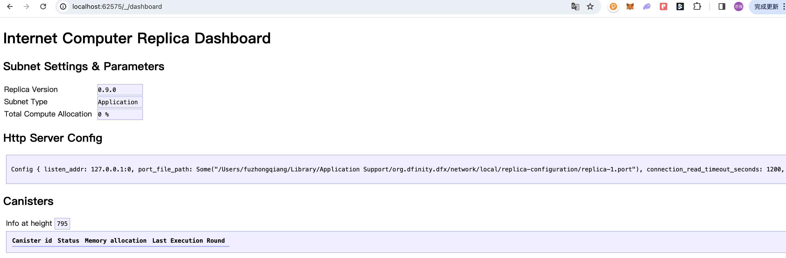
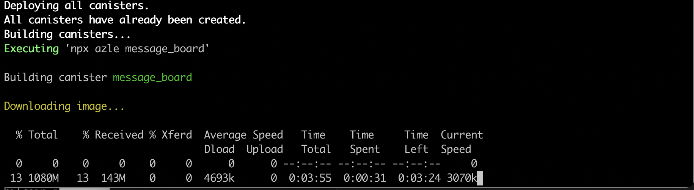

# iNFT-ICP
ICP hack house project, try to deploy the editor of iNFT on ICP.


## Resource

### How to

- Set up the env for ICP. There is details about the installaction here [https://dacade.org/zh/communities/icp/courses/typescript-smart-contract-101/learning-modules/b14741ea-ee33-43a4-a742-9cdc0a6f0d1c](https://dacade.org/zh/communities/icp/courses/typescript-smart-contract-101/learning-modules/b14741ea-ee33-43a4-a742-9cdc0a6f0d1c). Note, the `DFX` installaction need you to press `Enter` on `Proceed with installation (default)`, it is better to `Proceed with installation (press Enter to continue)`. I am waiting here for more than 15 mins, haha. And, use arrow button to select the menu.

    ```BASH
        sh -ci "$(curl -fsSL https://internetcomputer.org/install.sh)"
    ```

- On my macbook, the command can not run directly. The bin files are here `/Users/{YOUR_MACBOOK_USER_NAME}/Library/Application Support/org.dfinity.dfx/bin`. Change to this folder, run `./dfx --version` to confirm the application run properly.

- Try to start the server to check. Note, close the VPN, or you will get a 503 error.  

    ```BASH
        # normal suggestion.
        dfx start --host 127.0.0.1:8000

        # at your first time to start, there will be information to tell you add --clean flag
        # this is used to fresh the StableBTreeMap by force
        dfx start --host 127.0.0.1:8000 --clean
    ```

    ```BASH
        # My success message
        Running dfx start for version 0.19.0
        Using the default definition for the 'local' shared network because /Users/fuzhongqiang/.config/dfx/networks.json does not exist.
        Initialized replica.
        Dashboard: http://localhost:62575/_/dashboard
    ```

    The snap here.
    

- Create `dfx.json` and `package.json` properly, try to deploy the app on ICP. Note, the `Node` version should be >20, here is the guard [https://betterstack.com/community/questions/how-to-upgrade-node-js-on-macos/](https://betterstack.com/community/questions/how-to-upgrade-node-js-on-macos/).

    ```BASH
        dfx deploy
    ```

    If you are the first time to run, need to set up your account, try to generate a new one.

    ```BASH
        dfx identity new YOUR_NAME
    ```

    Then, take a coffee as normal way when compiling the code, you will get this.
    

### Links

- [https://internetcomputer.org/docs](https://internetcomputer.org/docs)

- [https://dacade.org/zh/communities/icp/courses/typescript-smart-contract-101/learning-modules/b14741ea-ee33-43a4-a742-9cdc0a6f0d1c](https://dacade.org/zh/communities/icp/courses/typescript-smart-contract-101/learning-modules/b14741ea-ee33-43a4-a742-9cdc0a6f0d1c)