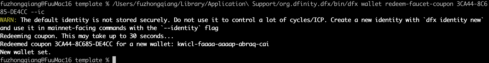

# iNFT-ICP

ICP hack house project, try to deploy the editor of iNFT on ICP.

## Resource

### How to

- Set up the env for ICP. There is details about the installaction here [https://dacade.org/zh/communities/icp/courses/typescript-smart-contract-101/learning-modules/b14741ea-ee33-43a4-a742-9cdc0a6f0d1c](https://dacade.org/zh/communities/icp/courses/typescript-smart-contract-101/learning-modules/b14741ea-ee33-43a4-a742-9cdc0a6f0d1c). **Note**, the `DFX` installaction need you to press `Enter` on `Proceed with installation (default)`, it is better to `Proceed with installation (press Enter to continue)`. I am waiting here for more than 15 mins, haha. And, use arrow button to select the menu.

    ```BASH
        sh -ci "$(curl -fsSL https://internetcomputer.org/install.sh)"
    ```

- On my macbook, the command can not run directly. The bin files are here `/Users/{YOUR_MACBOOK_USER_NAME}/Library/Application Support/org.dfinity.dfx/bin`. Change to this folder, run `./dfx --version` to confirm the application run properly.

- Try to start the server to check. Note, close the VPN, or you will get a 503 error.  

    ```BASH
        # normal suggestion.
        dfx start --host 127.0.0.1:8000

        # at your first time to start, there will be information to tell you add --clean flag
        # this is used to fresh the StableBTreeMap by force
        dfx start --host 127.0.0.1:8000 --clean
    ```

    ```BASH
        # My success message
        Running dfx start for version 0.19.0
        Using the default definition for the 'local' shared network because /Users/fuzhongqiang/.config/dfx/networks.json does not exist.
        Initialized replica.
        Dashboard: http://localhost:62575/_/dashboard
    ```

    The snap here.
    

- Create `dfx.json` and `package.json` properly, try to deploy the app on ICP. Note, the `Node` version should be >20, here is the guard [https://betterstack.com/community/questions/how-to-upgrade-node-js-on-macos/](https://betterstack.com/community/questions/how-to-upgrade-node-js-on-macos/).

    ```BASH
        dfx deploy
    ```

    If you are the first time to run, need to set up your account, try to generate a new one.

    ```BASH
        dfx identity new YOUR_NAME
    ```

    Then, take a coffee as normal way when compiling the code, you will get this. **Note**, there will be error if you forget to install some tools, such as `podman` as I did.

    

    The second time to deploy the Dapps.

    

    **Note**, the `npx azle message_board` failed after run `yarn install`, need to run `yarn add @dfinity/principal` by checking the error message. 

    Finally, deployed successful. Now, 30% job done !
    
    

- Checking the response by the following command lines:

    ```BASH
        #command
        curl -X POST http://bkyz2-fmaaa-aaaaa-qaaaq-cai.localhost:8066/messages -H "Content-type: application/json" -d '{"title": "todo list", "body": "some important things", "attachmentURL": "url/path/to/some/photo/attachment"}'

        #Result
        {"id":"b458518d-e851-4ffa-b6dd-133809c0fe1c","createdAt":"2024-04-09T04:32:32.514Z","title":"todo list","body":"some important things","attachmentURL":"url/path/to/some/photo/attachment"}
    ```

    Great, response from the on chain application.

### Mainnet

- Get the airdrop.

    ```BASH
        dfx wallet redeem-faucet-coupon 3CA44-8C685-DE4CC --ic
    ```

    You will get the response as follow.
    

- Deploy the **Template** Dapp on ICP mainnet.

    ```BASH
        dfx deploy --ic
    ```

    You will get the response as follow.
    

- Check the result

    ```BASH
        #check from the bash
        curl -X POST https://i6tq5-ziaaa-aaaap-ahaia-cai.icp0.io/test

        #The result, great hello world
        {"hello":"world"}
    ```

### Links

- [https://internetcomputer.org/docs](https://internetcomputer.org/docs)

- [https://dacade.org/zh/communities/icp/courses/typescript-smart-contract-101/learning-modules/b14741ea-ee33-43a4-a742-9cdc0a6f0d1c](https://dacade.org/zh/communities/icp/courses/typescript-smart-contract-101/learning-modules/b14741ea-ee33-43a4-a742-9cdc0a6f0d1c)